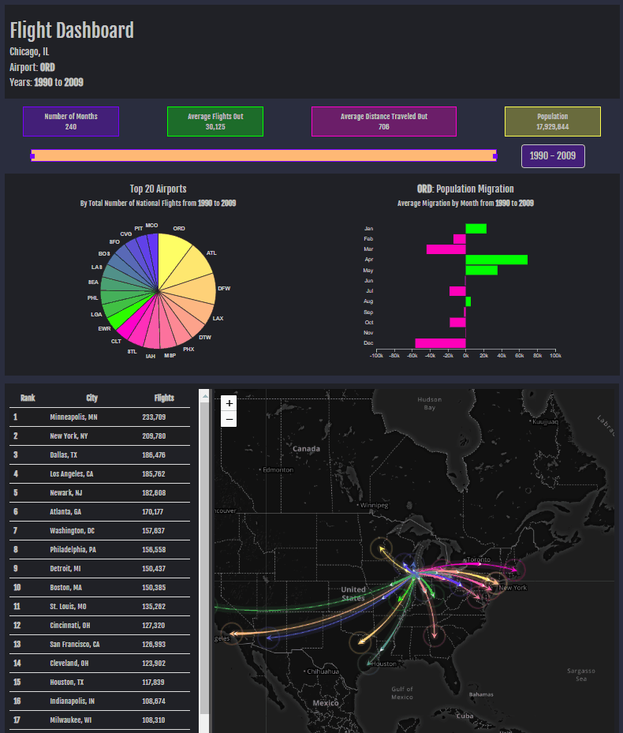

# Flight Dashboard

## Background

This dashboard is the result of the second project that is part if the Data Science Bootcamp at Northwestern University. It consists in interactive visualizations to explore flights within US from 1990 to 2009 and the database used has more than 3.5 million flight records from 650 airports in the US.

Source: [Academic Torrents](http://academictorrents.com/details/a2ccf94bbb4af222bf8e69dad60a68a29f310d9a) 

## Tools

The following tools were used to create the dashboard:
* MySQL
* Python and Flask
* HTML/CSS
* Bootstrap
* Java Script
* D3
* Leaflet.js
* Google Maps API

## Preview

